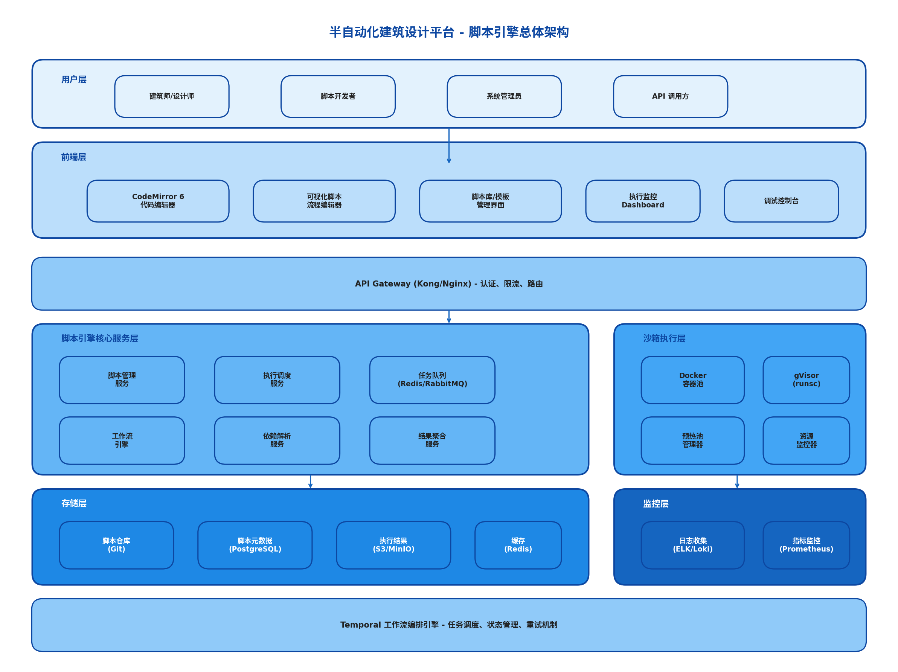
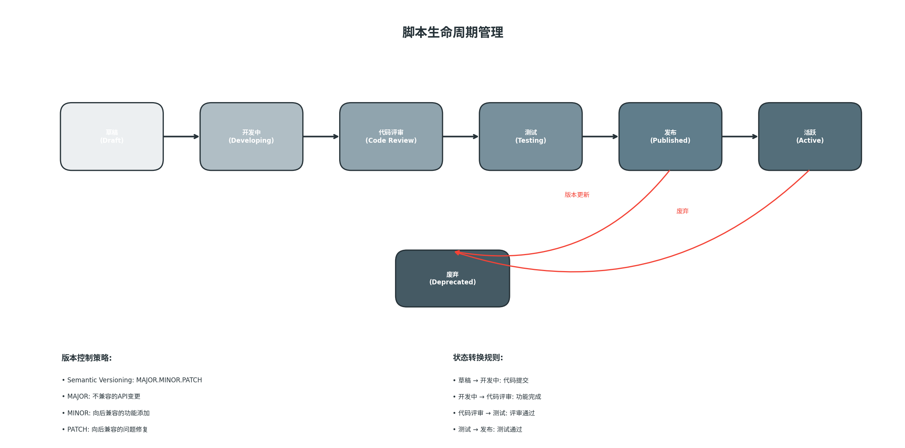
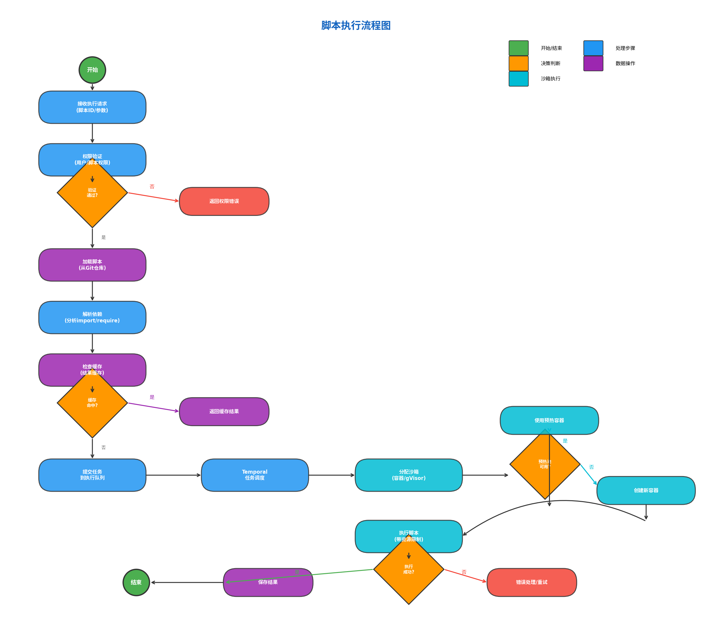
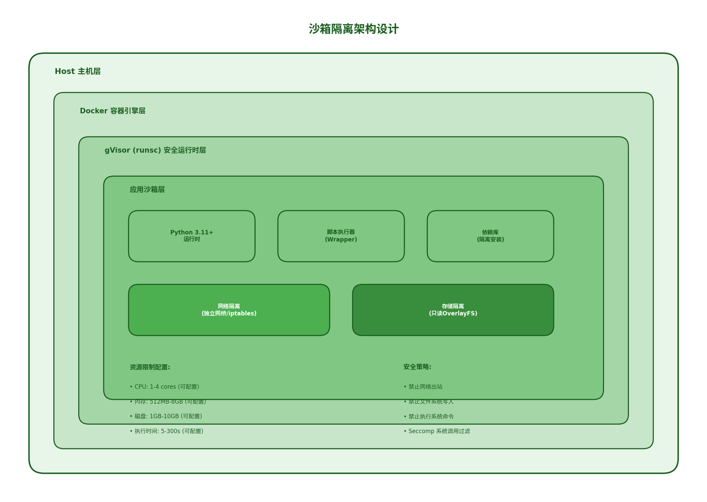
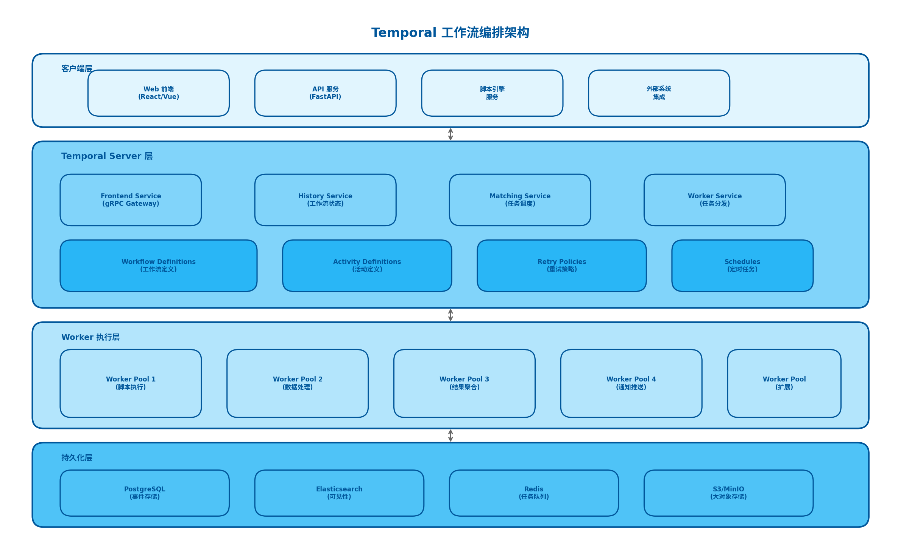
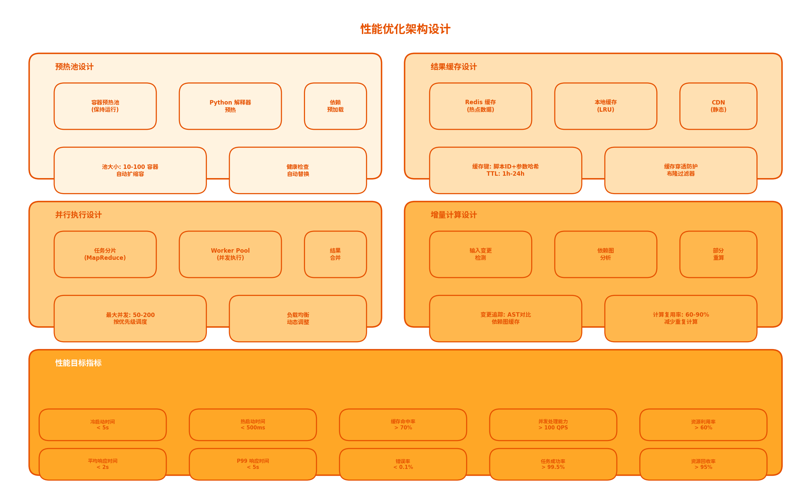
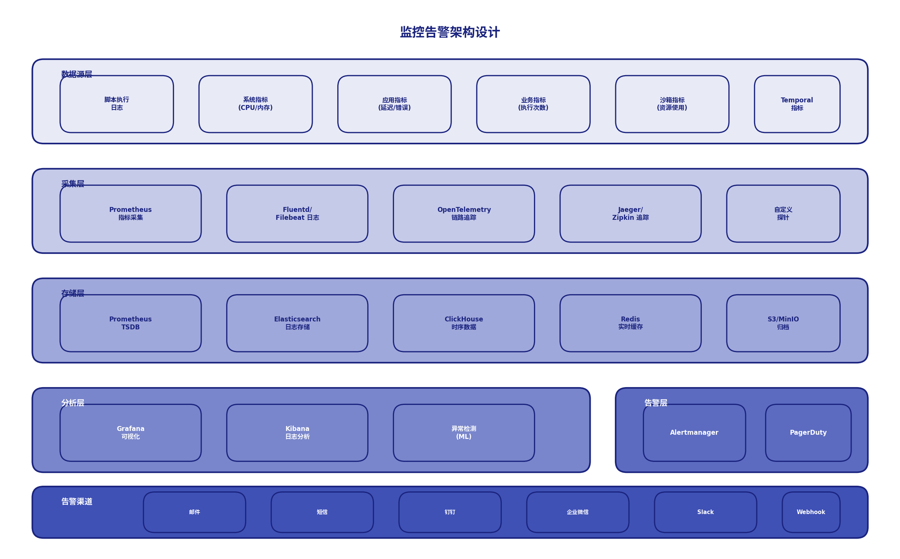

# 半自动化建筑设计平台 - 脚本引擎架构设计报告

**文档版本**: v1.0  
**编写日期**: 2024年  
**文档状态**: 概要设计阶段  

---

## 目录

1. [脚本引擎架构总体设计](#1-脚本引擎架构总体设计)
2. [脚本执行引擎设计](#2-脚本执行引擎设计)
3. [任务调度系统设计](#3-任务调度系统设计)
4. [脚本开发环境设计](#4-脚本开发环境设计)
5. [脚本库管理设计](#5-脚本库管理设计)
6. [性能优化设计](#6-性能优化设计)
7. [监控告警设计](#7-监控告警设计)

---

## 1. 脚本引擎架构总体设计

### 1.1 脚本系统分层架构

脚本引擎采用分层架构设计，从上到下分为以下层次：



#### 1.1.1 架构层次说明

| 层次 | 组件 | 职责 |
|------|------|------|
| **用户层** | 建筑师/设计师、脚本开发者、系统管理员、API调用方 | 使用脚本引擎的各类用户角色 |
| **前端层** | CodeMirror 6编辑器、可视化流程编辑器、脚本库管理界面、监控Dashboard、调试控制台 | 提供用户交互界面 |
| **API网关层** | Kong/Nginx | 统一入口，负责认证、限流、路由 |
| **核心服务层** | 脚本管理服务、执行调度服务、任务队列、工作流引擎、依赖解析服务、结果聚合服务 | 核心业务逻辑处理 |
| **沙箱执行层** | Docker容器池、gVisor运行时、预热池管理器、资源监控器 | 安全隔离的脚本执行环境 |
| **存储层** | Git仓库、PostgreSQL、S3/MinIO、Redis | 数据持久化存储 |
| **监控层** | ELK/Loki日志、Prometheus指标监控 | 系统监控与告警 |
| **调度层** | Temporal工作流引擎 | 任务调度与编排 |

### 1.2 脚本数据流设计

```
┌─────────────┐     ┌─────────────┐     ┌─────────────┐
│   用户请求   │────▶│  API网关    │────▶│ 权限验证    │
└─────────────┘     └─────────────┘     └─────────────┘
                                                │
                                                ▼
┌─────────────┐     ┌─────────────┐     ┌─────────────┐
│  返回结果    │◀────│  结果聚合    │◀────│ 执行完成    │
└─────────────┘     └─────────────┘     └─────────────┘
                                                ▲
                                                │
┌─────────────┐     ┌─────────────┐     ┌─────────────┐
│  沙箱执行    │◀────│  任务调度    │◀────│ 依赖解析    │
│  (Docker+   │     │  (Temporal) │     │  (分析import)│
│   gVisor)   │     └─────────────┘     └─────────────┘
└─────────────┘              ▲
                             │
┌─────────────┐     ┌─────────────┐
│  脚本仓库    │────▶│  脚本加载    │
│   (Git)     │     │  (版本控制)  │
└─────────────┘     └─────────────┘
```

### 1.3 脚本生命周期管理



#### 1.3.1 生命周期状态定义

| 状态 | 说明 | 转换条件 |
|------|------|----------|
| **草稿 (Draft)** | 初始创建状态，仅创建者可见 | 代码提交后进入开发中 |
| **开发中 (Developing)** | 正在开发修改中 | 功能完成后进入代码评审 |
| **代码评审 (Code Review)** | 等待或正在进行代码评审 | 评审通过后进入测试 |
| **测试 (Testing)** | 自动化测试执行中 | 测试通过后进入发布 |
| **发布 (Published)** | 已发布，可被其他用户使用 | 审核通过后进入活跃 |
| **活跃 (Active)** | 正常可用状态 | 版本更新或废弃时转换 |
| **废弃 (Deprecated)** | 已废弃，不再推荐使用 | - |

#### 1.3.2 版本控制策略

采用 **Semantic Versioning (语义化版本)** 规范：

```
版本格式: MAJOR.MINOR.PATCH
示例: 1.2.3

- MAJOR: 不兼容的API变更
- MINOR: 向后兼容的功能添加
- PATCH: 向后兼容的问题修复
```

### 1.4 脚本执行模式

#### 1.4.1 同步执行模式

```python
# 同步执行 - 适用于快速脚本 (< 5秒)
result = script_engine.execute_sync(
    script_id="script_001",
    params={"input": "data"},
    timeout=5
)
```

**特点**:
- 阻塞式调用，立即返回结果
- 使用预热容器，响应时间 < 500ms
- 适用于简单计算、数据转换等场景

#### 1.4.2 异步执行模式

```python
# 异步执行 - 适用于复杂脚本 (> 5秒)
task_id = script_engine.execute_async(
    script_id="script_002",
    params={"input": "data"},
    callback_url="https://api.example.com/callback"
)

# 查询执行状态
status = script_engine.get_status(task_id)
```

**特点**:
- 非阻塞式调用，返回任务ID
- 通过Temporal进行任务编排
- 支持执行进度回调
- 适用于复杂计算、批量处理等场景

#### 1.4.3 工作流执行模式

```python
# 工作流执行 - 多脚本编排
workflow = WorkflowBuilder()
    .add_step("step1", script_id="script_001")
    .add_step("step2", script_id="script_002", depends_on=["step1"])
    .add_step("step3", script_id="script_003", depends_on=["step1"])
    .add_step("step4", script_id="script_004", depends_on=["step2", "step3"])
    .build()

result = workflow_engine.execute(workflow)
```

**特点**:
- 支持多脚本依赖编排
- 支持并行执行和串行执行
- 支持条件分支和循环
- 支持子工作流嵌套

---

## 2. 脚本执行引擎设计

### 2.1 脚本执行流程设计



#### 2.1.1 执行流程详细说明

| 步骤 | 阶段 | 说明 | 处理时间 |
|------|------|------|----------|
| 1 | 接收请求 | 接收脚本执行请求，包含脚本ID和执行参数 | < 10ms |
| 2 | 权限验证 | 验证用户是否有权限执行该脚本 | < 50ms |
| 3 | 加载脚本 | 从Git仓库加载脚本代码 | < 100ms |
| 4 | 解析依赖 | 分析脚本import/require语句 | < 50ms |
| 5 | 检查缓存 | 检查是否有缓存的执行结果 | < 20ms |
| 6 | 提交任务 | 将执行任务提交到队列 | < 30ms |
| 7 | Temporal调度 | Temporal进行任务调度和编排 | < 100ms |
| 8 | 分配沙箱 | 分配预热容器或创建新容器 | < 500ms (热) / < 5s (冷) |
| 9 | 执行脚本 | 在沙箱中执行脚本 | 视脚本复杂度 |
| 10 | 保存结果 | 保存执行结果到存储 | < 100ms |

### 2.2 沙箱隔离设计



#### 2.2.1 多层隔离架构

```
┌─────────────────────────────────────────────────────────────┐
│                      Host 主机层                             │
│  ┌───────────────────────────────────────────────────────┐  │
│  │                Docker 容器引擎层                       │  │
│  │  ┌─────────────────────────────────────────────────┐  │  │
│  │  │           gVisor (runsc) 安全运行时层            │  │  │
│  │  │  ┌───────────────────────────────────────────┐  │  │  │
│  │  │  │              应用沙箱层                    │  │  │  │
│  │  │  │  ┌─────────┐  ┌─────────┐  ┌─────────┐   │  │  │  │
│  │  │  │  │ Python  │  │ 脚本执行 │  │ 依赖库  │   │  │  │  │
│  │  │  │  │ 运行时  │  │ Wrapper │  │ (隔离)  │   │  │  │  │
│  │  │  │  └─────────┘  └─────────┘  └─────────┘   │  │  │  │
│  │  │  │  ┌─────────────────────────────────────┐  │  │  │  │
│  │  │  │  │     网络隔离 (独立网桥/iptables)      │  │  │  │  │
│  │  │  │  └─────────────────────────────────────┘  │  │  │  │
│  │  │  │  ┌─────────────────────────────────────┐  │  │  │  │
│  │  │  │  │     存储隔离 (只读OverlayFS)         │  │  │  │  │
│  │  │  │  └─────────────────────────────────────┘  │  │  │  │
│  │  │  └───────────────────────────────────────────┘  │  │  │
│  │  └─────────────────────────────────────────────────┘  │  │
│  └───────────────────────────────────────────────────────┘  │
└─────────────────────────────────────────────────────────────┘
```

#### 2.2.2 隔离层次说明

| 隔离层次 | 技术方案 | 隔离目标 |
|----------|----------|----------|
| **主机隔离** | Docker容器 | 进程、文件系统、网络命名空间隔离 |
| **系统调用隔离** | gVisor (runsc) | 拦截和过滤系统调用，防止内核攻击 |
| **网络隔离** | 独立网桥 + iptables | 禁止出站网络访问 |
| **存储隔离** | OverlayFS只读挂载 | 禁止文件系统写入 |
| **资源隔离** | cgroups | CPU、内存、磁盘IO限制 |

### 2.3 资源限制设计

#### 2.3.1 资源配额配置

```yaml
# 资源限制配置示例
resource_limits:
  # 基础配置 (默认)
  basic:
    cpu: 1          # 1核
    memory: 512MB   # 512MB内存
    disk: 1GB       # 1GB磁盘
    timeout: 30s    # 30秒超时
  
  # 标准配置
  standard:
    cpu: 2
    memory: 1GB
    disk: 2GB
    timeout: 60s
  
  # 高级配置
  premium:
    cpu: 4
    memory: 4GB
    disk: 10GB
    timeout: 300s
```

#### 2.3.2 资源限制实现

```python
# Docker 资源限制配置
docker_container_config = {
    "CpuQuota": 100000,        # 1核 = 100000
    "CpuPeriod": 100000,
    "Memory": 512 * 1024 * 1024,  # 512MB
    "MemorySwap": 512 * 1024 * 1024,
    "DiskQuota": 1 * 1024 * 1024 * 1024,  # 1GB
    "NetworkMode": "none",     # 禁用网络
    "ReadonlyRootfs": True,    # 只读根文件系统
    "SecurityOpt": ["no-new-privileges:true"],
    "CapDrop": ["ALL"],        # 丢弃所有特权
}
```

### 2.4 安全策略设计

#### 2.4.1 安全策略矩阵

| 安全维度 | 策略 | 实现方式 |
|----------|------|----------|
| **代码安全** | 静态代码扫描 | Bandit, Pylint 检测危险代码 |
| **执行安全** | 沙箱隔离 | Docker + gVisor 双重隔离 |
| **网络安全** | 网络隔离 | 禁止出站连接，仅允许本地回环 |
| **存储安全** | 只读文件系统 | OverlayFS 只读挂载 |
| **系统安全** | Seccomp过滤 | 限制危险系统调用 |
| **资源安全** | 资源配额 | cgroups 限制资源使用 |

#### 2.4.2 禁止的操作清单

```python
# 禁止的系统调用 (Seccomp配置)
FORBIDDEN_SYSCALLS = [
    "execve",      # 禁止执行外部程序
    "fork",        # 禁止创建子进程
    "clone",       # 禁止创建线程
    "ptrace",      # 禁止进程跟踪
    "mount",       # 禁止挂载文件系统
    "umount",      # 禁止卸载文件系统
    "reboot",      # 禁止重启
    "sysctl",      # 禁止修改内核参数
]

# 禁止的Python模块
FORBIDDEN_MODULES = [
    "os.system",
    "subprocess",
    "socket",
    "urllib",
    "http.client",
    "ftplib",
    "telnetlib",
    "smtplib",
]
```

---

## 3. 任务调度系统设计

### 3.1 调度器架构设计



#### 3.1.1 Temporal核心组件

| 组件 | 职责 | 技术实现 |
|------|------|----------|
| **Frontend Service** | gRPC网关，接收客户端请求 | Go实现，高并发处理 |
| **History Service** | 管理工作流状态和历史 | 事件溯源模式 |
| **Matching Service** | 任务调度和匹配 | 高效的任务队列 |
| **Worker Service** | 任务分发到Worker | 负载均衡 |

#### 3.1.2 Worker Pool设计

```python
# Worker Pool 配置
worker_pools = {
    "script_executor": {
        "min_workers": 5,
        "max_workers": 50,
        "task_queue": "script-execution-queue",
        "concurrent_activities": 10,
    },
    "data_processor": {
        "min_workers": 3,
        "max_workers": 30,
        "task_queue": "data-processing-queue",
        "concurrent_activities": 5,
    },
    "result_aggregator": {
        "min_workers": 2,
        "max_workers": 20,
        "task_queue": "result-aggregation-queue",
        "concurrent_activities": 5,
    },
}
```

### 3.2 工作流编排设计

#### 3.2.1 工作流定义示例

```python
from temporalio import workflow
from temporalio.activity import activity
from datetime import timedelta

@workflow.defn
class ScriptExecutionWorkflow:
    @workflow.run
    async def run(self, script_id: str, params: dict) -> dict:
        # 1. 加载脚本
        script = await workflow.execute_activity(
            load_script,
            script_id,
            start_to_close_timeout=timedelta(seconds=10)
        )
        
        # 2. 解析依赖
        dependencies = await workflow.execute_activity(
            resolve_dependencies,
            script,
            start_to_close_timeout=timedelta(seconds=10)
        )
        
        # 3. 并行安装依赖
        install_tasks = [
            workflow.execute_activity(
                install_dependency,
                dep,
                start_to_close_timeout=timedelta(seconds=60)
            )
            for dep in dependencies
        ]
        await asyncio.gather(*install_tasks)
        
        # 4. 执行脚本
        result = await workflow.execute_activity(
            execute_script,
            {"script": script, "params": params},
            start_to_close_timeout=timedelta(seconds=300)
        )
        
        # 5. 保存结果
        await workflow.execute_activity(
            save_result,
            result,
            start_to_close_timeout=timedelta(seconds=10)
        )
        
        return result
```

#### 3.2.2 工作流模式支持

| 模式 | 说明 | 使用场景 |
|------|------|----------|
| **顺序执行** | 按顺序执行多个活动 | 有依赖关系的脚本 |
| **并行执行** | 同时执行多个独立活动 | 无依赖的批量处理 |
| **条件分支** | 根据条件选择执行路径 | 动态流程控制 |
| **循环执行** | 重复执行直到满足条件 | 批量处理、重试 |
| **定时执行** | 按时间表触发执行 | 定时任务、调度 |
| **子工作流** | 嵌套调用其他工作流 | 复杂流程拆分 |

### 3.3 依赖管理设计

#### 3.3.1 依赖解析流程

```
┌─────────────┐     ┌─────────────┐     ┌─────────────┐
│  脚本代码    │────▶│  AST解析    │────▶│ 提取import  │
└─────────────┘     └─────────────┘     └─────────────┘
                                                │
                                                ▼
┌─────────────┐     ┌─────────────┐     ┌─────────────┐
│  依赖安装    │◀────│ 版本冲突    │◀────│ 查询依赖库  │
│  (并行)     │     │  解决       │     │  (PyPI/私有)│
└─────────────┘     └─────────────┘     └─────────────┘
```

#### 3.3.2 依赖缓存策略

```python
# 依赖缓存配置
dependency_cache = {
    "cache_backend": "redis",
    "cache_ttl": 3600,  # 1小时
    "preinstalled_packages": [
        "numpy",
        "pandas",
        "matplotlib",
        "shapely",
        "trimesh",
    ],
    "package_index": {
        "primary": "https://pypi.org/simple",
        "mirror": "https://mirrors.aliyun.com/pypi/simple",
        "private": "https://private.pypi.com/simple",
    }
}
```

### 3.4 失败重试设计

#### 3.4.1 重试策略配置

```python
# 重试策略配置
retry_policies = {
    # 默认重试策略
    "default": {
        "initial_interval": 1,      # 初始间隔1秒
        "backoff_coefficient": 2.0,  # 指数退避系数
        "maximum_interval": 60,      # 最大间隔60秒
        "maximum_attempts": 3,       # 最大重试次数
        "non_retryable_error_types": ["InvalidScriptError"],
    },
    # 网络操作重试
    "network": {
        "initial_interval": 1,
        "backoff_coefficient": 2.0,
        "maximum_interval": 30,
        "maximum_attempts": 5,
    },
    # 沙箱执行重试
    "sandbox": {
        "initial_interval": 5,
        "backoff_coefficient": 1.5,
        "maximum_interval": 60,
        "maximum_attempts": 2,
    },
}
```

#### 3.4.2 错误分类处理

| 错误类型 | 说明 | 处理策略 |
|----------|------|----------|
| **可重试错误** | 临时性问题，如网络超时 | 自动重试 |
| **不可重试错误** | 逻辑错误，如语法错误 | 立即失败 |
| **资源错误** | 资源不足，如内存溢出 | 扩容后重试 |
| **超时错误** | 执行超时 | 根据策略重试或失败 |

---

## 4. 脚本开发环境设计

### 4.1 代码编辑器设计

#### 4.1.1 CodeMirror 6 配置

```javascript
// CodeMirror 6 编辑器配置
import { EditorView, basicSetup } from "codemirror"
import { python } from "@codemirror/lang-python"
import { oneDark } from "@codemirror/theme-one-dark"
import { autocompletion } from "@codemirror/autocomplete"
import { lintGutter, linter } from "@codemirror/lint"

const editorConfig = {
    extensions: [
        basicSetup,
        python(),
        oneDark,
        autocompletion({
            override: [pythonCompletions]
        }),
        lintGutter(),
        linter(pythonLinter),
        keymap.of([...defaultKeymap, ...pythonKeymap]),
    ],
    
    // 编辑器选项
    options: {
        lineNumbers: true,
        foldGutter: true,
        highlightActiveLine: true,
        highlightSelectionMatches: true,
        tabSize: 4,
        indentUnit: 4,
        lineWrapping: true,
    }
}
```

#### 4.1.2 编辑器功能清单

| 功能 | 说明 | 优先级 |
|------|------|--------|
| **语法高亮** | Python语法高亮 | P0 |
| **代码折叠** | 函数/类级别折叠 | P0 |
| **行号显示** | 左侧显示行号 | P0 |
| **括号匹配** | 自动匹配括号 | P0 |
| **自动缩进** | 智能缩进 | P0 |
| **多光标编辑** | 多处同时编辑 | P1 |
| **代码搜索** | 查找/替换 | P1 |
| **差异对比** | 版本对比 | P1 |
| **主题切换** | 明暗主题 | P2 |

### 4.2 代码补全设计

#### 4.2.1 补全来源

```python
# 代码补全来源配置
completion_sources = {
    # Python 标准库
    "stdlib": {
        "enabled": True,
        "modules": ["os", "sys", "json", "math", "random", "datetime"],
    },
    # 第三方库
    "third_party": {
        "enabled": True,
        "modules": ["numpy", "pandas", "matplotlib", "shapely"],
    },
    # 平台API
    "platform_api": {
        "enabled": True,
        "endpoints": [
            "platform.get_model()",
            "platform.create_geometry()",
            "platform.export_result()",
        ],
    },
    # 用户自定义
    "user_defined": {
        "enabled": True,
        "cache_ttl": 300,
    },
}
```

#### 4.2.2 LSP 语言服务器

```python
# LSP 服务器配置
lsp_config = {
    "server": "pylsp",  # Python LSP Server
    "settings": {
        "pylsp": {
            "plugins": {
                "jedi_completion": {"enabled": True},
                "jedi_hover": {"enabled": True},
                "jedi_references": {"enabled": True},
                "jedi_signature_help": {"enabled": True},
                "jedi_symbols": {"enabled": True},
                "pycodestyle": {"enabled": True, "maxLineLength": 100},
                "pylint": {"enabled": True},
                "mypy": {"enabled": True},
            }
        }
    }
}
```

### 4.3 调试功能设计

#### 4.3.1 调试功能清单

| 功能 | 说明 | 实现方式 |
|------|------|----------|
| **断点设置** | 在指定行设置断点 | CodeMirror断点插件 |
| **单步执行** | 逐行执行代码 | pdb集成 |
| **变量查看** | 查看当前变量值 | 运行时变量提取 |
| **调用栈** | 查看函数调用栈 | traceback分析 |
| **表达式求值** | 执行任意表达式 | eval执行 |
| **日志输出** | 查看print输出 | 重定向stdout |

#### 4.3.2 调试协议

```python
# 调试协议消息格式
class DebugMessage:
    BREAKPOINT_SET = "breakpoint_set"      # 设置断点
    BREAKPOINT_REMOVE = "breakpoint_remove" # 移除断点
    STEP_OVER = "step_over"                 # 单步跳过
    STEP_INTO = "step_into"                 # 单步进入
    STEP_OUT = "step_out"                   # 单步跳出
    CONTINUE = "continue"                   # 继续执行
    PAUSE = "pause"                         # 暂停执行
    EVALUATE = "evaluate"                   # 求值表达式
    
# 调试响应格式
class DebugResponse:
    STOPPED = "stopped"                     # 执行停止
    RUNNING = "running"                     # 正在执行
    VARIABLES = "variables"                 # 变量信息
    OUTPUT = "output"                       # 输出信息
```

### 4.4 版本管理设计

#### 4.4.1 Git 集成

```python
# Git 操作封装
class ScriptVersionManager:
    def __init__(self, repo_path: str):
        self.repo = git.Repo(repo_path)
    
    def commit(self, message: str, author: str):
        """提交代码变更"""
        self.repo.index.add("*")
        self.repo.index.commit(message, author=author)
    
    def create_branch(self, branch_name: str, base: str = "main"):
        """创建新分支"""
        base_ref = self.repo.refs[base]
        self.repo.create_head(branch_name, base_ref)
    
    def merge(self, branch_name: str, target: str = "main"):
        """合并分支"""
        target_branch = self.repo.heads[target]
        merge_branch = self.repo.heads[branch_name]
        self.repo.git.merge(merge_branch, target_branch)
    
    def get_history(self, script_id: str, limit: int = 50):
        """获取脚本版本历史"""
        commits = list(self.repo.iter_commits(
            paths=f"{script_id}.py",
            max_count=limit
        ))
        return [
            {
                "hash": c.hexsha[:8],
                "message": c.message,
                "author": c.author.name,
                "date": c.committed_datetime,
            }
            for c in commits
        ]
```

#### 4.4.2 版本对比

```python
# 版本对比功能
def diff_versions(script_id: str, old_version: str, new_version: str) -> dict:
    """对比两个版本的差异"""
    old_code = get_script_at_version(script_id, old_version)
    new_code = get_script_at_version(script_id, new_version)
    
    diff = difflib.unified_diff(
        old_code.splitlines(),
        new_code.splitlines(),
        fromfile=f"{script_id}@{old_version}",
        tofile=f"{script_id}@{new_version}",
        lineterm=""
    )
    
    return {
        "added_lines": count_added_lines(diff),
        "removed_lines": count_removed_lines(diff),
        "diff_html": render_diff_html(diff),
    }
```

---

## 5. 脚本库管理设计

### 5.1 脚本仓库设计

#### 5.1.1 仓库结构

```
script-repository/
├── scripts/                    # 脚本代码目录
│   ├── geometry/
│   │   ├── __init__.py
│   │   ├── create_cube.py
│   │   └── create_sphere.py
│   ├── analysis/
│   │   ├── __init__.py
│   │   ├── volume_calc.py
│   │   └── surface_area.py
│   └── export/
│       ├── __init__.py
│       ├── export_dxf.py
│       └── export_obj.py
├── templates/                  # 脚本模板目录
│   ├── basic_script.py
│   ├── geometry_script.py
│   └── analysis_script.py
├── tests/                      # 测试目录
│   ├── test_geometry.py
│   └── test_analysis.py
├── docs/                       # 文档目录
│   ├── api_reference.md
│   └── tutorial.md
├── metadata/                   # 元数据目录
│   └── scripts.json
└── README.md
```

#### 5.1.2 元数据管理

```python
# 脚本元数据模型
class ScriptMetadata(BaseModel):
    id: str                           # 脚本唯一ID
    name: str                         # 脚本名称
    description: str                  # 脚本描述
    version: str                      # 版本号
    author: str                       # 作者
    created_at: datetime              # 创建时间
    updated_at: datetime              # 更新时间
    status: ScriptStatus              # 状态
    tags: List[str]                   # 标签
    category: str                     # 分类
    dependencies: List[str]           # 依赖列表
    inputs: List[ScriptInput]         # 输入参数定义
    outputs: List[ScriptOutput]       # 输出定义
    examples: List[ScriptExample]     # 使用示例
    documentation: str                # 文档链接
```

### 5.2 脚本版本控制

#### 5.2.1 版本管理策略

```python
# 版本管理配置
version_config = {
    # 版本号格式
    "version_format": "semver",  # semantic versioning
    
    # 版本分支策略
    "branching_strategy": "gitflow",
    
    # 版本发布流程
    "release_process": [
        "1. 创建 release 分支",
        "2. 版本号更新",
        "3. 更新 CHANGELOG",
        "4. 代码评审",
        "5. 合并到 main",
        "6. 打 tag",
        "7. 发布到仓库",
    ],
    
    # 版本兼容性
    "compatibility": {
        "backward_compatible": ["minor", "patch"],
        "breaking_changes": ["major"],
    }
}
```

#### 5.2.2 版本回滚

```python
# 版本回滚功能
class VersionRollback:
    def rollback_to_version(self, script_id: str, target_version: str):
        """回滚到指定版本"""
        # 1. 获取目标版本代码
        target_code = self.get_script_code(script_id, target_version)
        
        # 2. 创建回滚记录
        rollback_record = {
            "script_id": script_id,
            "from_version": self.get_current_version(script_id),
            "to_version": target_version,
            "timestamp": datetime.now(),
            "reason": "用户手动回滚",
        }
        
        # 3. 应用回滚
        self.update_script(script_id, target_code)
        
        # 4. 记录回滚历史
        self.save_rollback_history(rollback_record)
        
        return rollback_record
```

### 5.3 脚本共享机制

#### 5.3.1 共享权限模型

```python
# 权限模型
class ScriptPermission(Enum):
    PRIVATE = "private"       # 私有，仅自己可见
    TEAM = "team"            # 团队内共享
    ORGANIZATION = "org"     # 组织内共享
    PUBLIC = "public"        # 公开共享

class ScriptSharing:
    def share_script(self, script_id: str, permission: ScriptPermission, 
                     target_users: List[str] = None):
        """共享脚本"""
        script = self.get_script(script_id)
        script.permission = permission
        
        if permission == ScriptPermission.TEAM:
            script.shared_with = target_users
        
        self.update_script(script)
        
        # 发送通知
        self.notify_users(target_users, f"脚本 {script.name} 已共享给您")
```

#### 5.3.2 脚本市场

```python
# 脚本市场功能
class ScriptMarketplace:
    def search_scripts(self, query: str, filters: dict) -> List[ScriptMetadata]:
        """搜索脚本"""
        return self.script_repo.search(
            query=query,
            category=filters.get("category"),
            tags=filters.get("tags"),
            author=filters.get("author"),
            sort_by=filters.get("sort_by", "downloads"),
        )
    
    def install_script(self, script_id: str, user_id: str):
        """安装脚本到用户空间"""
        script = self.get_script(script_id)
        
        # 复制脚本到用户目录
        self.copy_script_to_user(script, user_id)
        
        # 更新安装计数
        self.increment_download_count(script_id)
        
        # 记录安装历史
        self.record_installation(script_id, user_id)
```

### 5.4 脚本模板设计

#### 5.4.1 模板类型

| 模板类型 | 说明 | 适用场景 |
|----------|------|----------|
| **基础脚本模板** | 包含基本结构 | 通用脚本开发 |
| **几何创建模板** | 包含几何操作API | 创建3D几何体 |
| **分析计算模板** | 包含分析函数 | 几何分析计算 |
| **数据导入模板** | 包含导入逻辑 | 导入外部数据 |
| **结果导出模板** | 包含导出逻辑 | 导出计算结果 |

#### 5.4.2 模板引擎

```python
# 基础脚本模板
BASIC_SCRIPT_TEMPLATE = '''
"""
脚本名称: {{ script_name }}
作者: {{ author }}
描述: {{ description }}
"""

import platform

# 获取输入参数
params = platform.get_input_params()

# 主函数
def main():
    # TODO: 实现脚本逻辑
    result = process(params)
    
    # 返回结果
    platform.return_result(result)

def process(params):
    """处理逻辑"""
    # TODO: 实现处理逻辑
    return {"status": "success", "data": {}}

if __name__ == "__main__":
    main()
'''

# 几何创建模板
GEOMETRY_SCRIPT_TEMPLATE = '''
"""
几何创建脚本
"""

import platform
from platform.geometry import create_box, create_sphere, create_cylinder

params = platform.get_input_params()

def main():
    # 创建几何体
    geometry_type = params.get("type", "box")
    dimensions = params.get("dimensions", {})
    
    if geometry_type == "box":
        geometry = create_box(
            width=dimensions.get("width", 1),
            height=dimensions.get("height", 1),
            depth=dimensions.get("depth", 1)
        )
    elif geometry_type == "sphere":
        geometry = create_sphere(
            radius=dimensions.get("radius", 1)
        )
    
    # 返回结果
    platform.return_result({
        "geometry_id": geometry.id,
        "volume": geometry.volume,
        "surface_area": geometry.surface_area
    })

if __name__ == "__main__":
    main()
'''
```

---

## 6. 性能优化设计

### 6.1 预热池设计



#### 6.1.1 预热池架构

```python
# 预热池管理器
class WarmPoolManager:
    def __init__(self):
        self.pools = {}
        self.min_pool_size = 10
        self.max_pool_size = 100
        
    async def initialize_pool(self, runtime_type: str):
        """初始化预热池"""
        pool = ContainerPool(
            runtime_type=runtime_type,
            min_size=self.min_pool_size,
            max_size=self.max_pool_size,
        )
        
        # 预热容器
        for _ in range(self.min_pool_size):
            container = await pool.create_container()
            await self.warm_container(container)
            pool.add_to_pool(container)
        
        self.pools[runtime_type] = pool
    
    async def warm_container(self, container: Container):
        """预热容器"""
        # 1. 启动Python解释器
        await container.execute("python -c 'import sys; print(sys.version)'")
        
        # 2. 预加载常用依赖
        preloaded_modules = [
            "numpy", "pandas", "matplotlib",
            "shapely", "trimesh", "platform_api"
        ]
        for module in preloaded_modules:
            await container.execute(f"python -c 'import {module}'")
    
    async def acquire_container(self, runtime_type: str) -> Container:
        """获取容器"""
        pool = self.pools.get(runtime_type)
        
        if pool and pool.available_count > 0:
            return pool.acquire()
        
        # 池为空，创建新容器
        return await pool.create_container()
    
    async def release_container(self, runtime_type: str, container: Container):
        """释放容器回池"""
        pool = self.pools.get(runtime_type)
        
        if pool and pool.size < self.max_pool_size:
            # 重置容器状态
            await self.reset_container(container)
            pool.release(container)
        else:
            # 销毁容器
            await container.destroy()
```

#### 6.1.2 预热池监控

```python
# 预热池指标
pool_metrics = {
    "pool_size": "当前池大小",
    "available_count": "可用容器数",
    "in_use_count": "使用中容器数",
    "create_rate": "容器创建速率",
    "acquire_latency": "获取容器延迟",
    "hit_rate": "池命中率",
    "warmup_time": "预热时间",
}
```

### 6.2 增量计算设计

#### 6.2.1 变更检测

```python
# 增量计算引擎
class IncrementalEngine:
    def __init__(self):
        self.dependency_graph = DependencyGraph()
        self.cache = ResultCache()
    
    def detect_changes(self, script_id: str, new_code: str, 
                       old_code: str) -> List[str]:
        """检测代码变更"""
        # 1. 解析AST
        new_ast = ast.parse(new_code)
        old_ast = ast.parse(old_code)
        
        # 2. 比较AST差异
        changes = self.compare_ast(new_ast, old_ast)
        
        # 3. 分析影响范围
        affected_nodes = self.dependency_graph.get_affected_nodes(changes)
        
        return affected_nodes
    
    def compute_incremental(self, script_id: str, params: dict,
                           changed_nodes: List[str]) -> dict:
        """增量计算"""
        # 1. 获取缓存结果
        cached_result = self.cache.get(script_id, params)
        
        # 2. 只重新计算变更的部分
        for node in changed_nodes:
            partial_result = self.compute_partial(script_id, node, params)
            cached_result.update(partial_result)
        
        # 3. 更新缓存
        self.cache.set(script_id, params, cached_result)
        
        return cached_result
```

#### 6.2.2 依赖图管理

```python
# 依赖图
class DependencyGraph:
    def __init__(self):
        self.graph = nx.DiGraph()
    
    def build_from_script(self, script_id: str, code: str):
        """从脚本构建依赖图"""
        tree = ast.parse(code)
        
        for node in ast.walk(tree):
            if isinstance(node, ast.FunctionDef):
                # 添加函数节点
                self.graph.add_node(node.name, type="function")
                
                # 分析函数依赖
                for child in ast.walk(node):
                    if isinstance(child, ast.Call):
                        if isinstance(child.func, ast.Name):
                            # 添加函数调用边
                            self.graph.add_edge(node.name, child.func.id)
    
    def get_affected_nodes(self, changed_nodes: List[str]) -> List[str]:
        """获取受影响的节点"""
        affected = set()
        
        for node in changed_nodes:
            # 获取所有依赖此节点的节点
            descendants = nx.descendants(self.graph, node)
            affected.update(descendants)
        
        return list(affected)
```

### 6.3 结果缓存设计

#### 6.3.1 缓存策略

```python
# 缓存管理器
class ResultCache:
    def __init__(self):
        self.redis = Redis()
        self.local_cache = LRUCache(maxsize=1000)
        
    def generate_cache_key(self, script_id: str, params: dict) -> str:
        """生成缓存键"""
        # 对参数进行哈希
        params_hash = hashlib.sha256(
            json.dumps(params, sort_keys=True).encode()
        ).hexdigest()[:16]
        
        return f"script:{script_id}:params:{params_hash}"
    
    async def get(self, script_id: str, params: dict) -> Optional[dict]:
        """获取缓存结果"""
        cache_key = self.generate_cache_key(script_id, params)
        
        # 1. 先查本地缓存
        if cache_key in self.local_cache:
            return self.local_cache[cache_key]
        
        # 2. 查Redis缓存
        cached = await self.redis.get(cache_key)
        if cached:
            result = json.loads(cached)
            # 写入本地缓存
            self.local_cache[cache_key] = result
            return result
        
        return None
    
    async def set(self, script_id: str, params: dict, result: dict,
                  ttl: int = 3600):
        """设置缓存"""
        cache_key = self.generate_cache_key(script_id, params)
        
        # 写入Redis
        await self.redis.setex(
            cache_key,
            ttl,
            json.dumps(result)
        )
        
        # 写入本地缓存
        self.local_cache[cache_key] = result
```

#### 6.3.2 缓存失效策略

```python
# 缓存失效策略
cache_invalidation_strategies = {
    # TTL 过期
    "ttl": {
        "default_ttl": 3600,  # 1小时
        "short_ttl": 300,     # 5分钟
        "long_ttl": 86400,    # 24小时
    },
    
    # 主动失效
    "active": {
        "on_script_update": True,  # 脚本更新时失效
        "on_dependency_change": True,  # 依赖变更时失效
    },
    
    # 布隆过滤器防止穿透
    "bloom_filter": {
        "enabled": True,
        "expected_elements": 100000,
        "false_positive_rate": 0.01,
    }
}
```

### 6.4 并行执行设计

#### 6.4.1 任务分片

```python
# 并行执行引擎
class ParallelExecutor:
    def __init__(self):
        self.worker_pool = WorkerPool()
        self.max_concurrency = 100
    
    async def execute_parallel(self, tasks: List[Task]) -> List[Result]:
        """并行执行任务"""
        # 1. 任务分片
        batches = self.split_into_batches(tasks, self.max_concurrency)
        
        results = []
        for batch in batches:
            # 2. 并行执行批次
            batch_results = await asyncio.gather(*[
                self.execute_task(task) for task in batch
            ])
            results.extend(batch_results)
        
        return results
    
    def split_into_batches(self, tasks: List[Task], 
                          batch_size: int) -> List[List[Task]]:
        """将任务分片"""
        return [
            tasks[i:i + batch_size] 
            for i in range(0, len(tasks), batch_size)
        ]
```

#### 6.4.2 工作流并行

```python
# Temporal 并行工作流
@workflow.defn
class ParallelScriptWorkflow:
    @workflow.run
    async def run(self, script_ids: List[str], params: dict) -> List[dict]:
        # 并行执行多个脚本
        tasks = [
            workflow.execute_activity(
                execute_single_script,
                {"script_id": sid, "params": params},
                start_to_close_timeout=timedelta(seconds=300)
            )
            for sid in script_ids
        ]
        
        # 等待所有任务完成
        results = await asyncio.gather(*tasks)
        
        return results
```

---

## 7. 监控告警设计

### 7.1 执行监控设计



#### 7.1.1 监控指标体系

| 指标类别 | 指标名称 | 说明 | 采集频率 |
|----------|----------|------|----------|
| **系统指标** | CPU使用率 | 容器CPU使用百分比 | 15s |
| | 内存使用率 | 容器内存使用百分比 | 15s |
| | 磁盘IO | 磁盘读写速率 | 30s |
| | 网络IO | 网络收发速率 | 30s |
| **应用指标** | 执行延迟 | 脚本执行耗时 | 每次执行 |
| | 执行成功率 | 成功执行占比 | 1min |
| | 并发数 | 当前执行中任务数 | 15s |
| | 队列深度 | 等待执行任务数 | 15s |
| **业务指标** | 执行次数 | 脚本执行总次数 | 1min |
| | 活跃脚本数 | 有执行的脚本数量 | 5min |
| | 用户活跃度 | 活跃用户数量 | 5min |

#### 7.1.2 监控Dashboard

```yaml
# Grafana Dashboard 配置
dashboard:
  title: "脚本引擎监控大盘"
  panels:
    - title: "执行QPS"
      type: graph
      query: 'rate(script_execution_total[1m])'
      
    - title: "执行延迟P99"
      type: graph
      query: 'histogram_quantile(0.99, script_execution_duration_bucket)'
      
    - title: "执行成功率"
      type: stat
      query: 'script_execution_success / script_execution_total'
      
    - title: "并发执行数"
      type: graph
      query: 'script_concurrent_executions'
      
    - title: "队列深度"
      type: graph
      query: 'script_queue_depth'
      
    - title: "沙箱资源使用"
      type: graph
      query: 'container_cpu_usage / container_cpu_limit'
```

### 7.2 日志收集设计

#### 7.2.1 日志架构

```
┌─────────────┐     ┌─────────────┐     ┌─────────────┐
│  应用日志    │────▶│  Fluentd/  │────▶│ Elasticsearch│
│  (结构化)    │     │  Filebeat  │     │  (日志存储)  │
└─────────────┘     └─────────────┘     └─────────────┘
                                                │
                                                ▼
┌─────────────┐     ┌─────────────┐     ┌─────────────┐
│  Kibana     │◀────│  日志分析    │◀────│  日志索引    │
│  (可视化)    │     │  (查询/聚合) │     │  (分片存储)  │
└─────────────┘     └─────────────┘     └─────────────┘
```

#### 7.2.2 日志格式

```python
# 结构化日志格式
log_format = {
    "timestamp": "2024-01-15T10:30:00Z",  # ISO 8601格式
    "level": "INFO",                       # 日志级别
    "service": "script-engine",            # 服务名称
    "trace_id": "abc123",                  # 链路追踪ID
    "span_id": "def456",                   # 跨度ID
    "message": "脚本执行完成",              # 日志消息
    "context": {                           # 上下文信息
        "script_id": "script_001",
        "execution_id": "exec_123",
        "user_id": "user_001",
        "duration_ms": 1500,
        "status": "success",
    }
}
```

### 7.3 告警机制设计

#### 7.3.1 告警规则

```yaml
# 告警规则配置
alerting_rules:
  # 执行延迟告警
  - name: HighExecutionLatency
    expr: histogram_quantile(0.99, script_execution_duration_bucket) > 5
    for: 5m
    labels:
      severity: warning
    annotations:
      summary: "脚本执行延迟过高"
      description: "P99执行延迟超过5秒"
  
  # 执行失败率告警
  - name: HighFailureRate
    expr: rate(script_execution_failed[5m]) / rate(script_execution_total[5m]) > 0.05
    for: 5m
    labels:
      severity: critical
    annotations:
      summary: "脚本执行失败率过高"
      description: "失败率超过5%"
  
  # 队列积压告警
  - name: QueueBacklog
    expr: script_queue_depth > 100
    for: 10m
    labels:
      severity: warning
    annotations:
      summary: "任务队列积压"
      description: "队列深度超过100"
  
  # 资源使用率告警
  - name: HighResourceUsage
    expr: container_cpu_usage / container_cpu_limit > 0.9
    for: 10m
    labels:
      severity: warning
    annotations:
      summary: "容器CPU使用率过高"
      description: "CPU使用率超过90%"
```

#### 7.3.2 告警通知

```python
# 告警通知配置
notification_channels = {
    "email": {
        "enabled": True,
        "recipients": ["ops@example.com"],
        "smtp_server": "smtp.example.com",
    },
    "sms": {
        "enabled": True,
        "recipients": ["+86-138xxxx"],
        "provider": "aliyun",
    },
    "dingtalk": {
        "enabled": True,
        "webhook": "https://oapi.dingtalk.com/robot/send?access_token=xxx",
    },
    "wechat": {
        "enabled": True,
        "webhook": "https://qyapi.weixin.qq.com/cgi-bin/webhook/send?key=xxx",
    },
    "slack": {
        "enabled": True,
        "webhook": "https://hooks.slack.com/services/xxx",
    },
    "pagerduty": {
        "enabled": True,
        "service_key": "xxx",
    },
}
```

### 7.4 性能分析设计

#### 7.4.1 性能分析工具

| 工具 | 用途 | 使用场景 |
|------|------|----------|
| **cProfile** | Python性能分析 | 脚本执行性能分析 |
| **py-spy** | 采样分析器 | 生产环境性能分析 |
| **memory_profiler** | 内存分析 | 内存泄漏检测 |
| **line_profiler** | 行级分析 | 热点代码定位 |

#### 7.4.2 性能报告

```python
# 性能分析报告
class PerformanceReport:
    def generate_report(self, execution_id: str) -> dict:
        """生成性能分析报告"""
        execution = self.get_execution(execution_id)
        
        report = {
            "execution_id": execution_id,
            "script_id": execution.script_id,
            "duration_ms": execution.duration_ms,
            "breakdown": {
                "load_script_ms": execution.timing.load_script,
                "resolve_deps_ms": execution.timing.resolve_deps,
                "create_sandbox_ms": execution.timing.create_sandbox,
                "execute_ms": execution.timing.execute,
                "save_result_ms": execution.timing.save_result,
            },
            "resource_usage": {
                "cpu_seconds": execution.resources.cpu_seconds,
                "memory_peak_mb": execution.resources.memory_peak_mb,
                "disk_read_mb": execution.resources.disk_read_mb,
                "disk_write_mb": execution.resources.disk_write_mb,
            },
            "recommendations": self.generate_recommendations(execution),
        }
        
        return report
    
    def generate_recommendations(self, execution: Execution) -> List[str]:
        """生成优化建议"""
        recommendations = []
        
        # 检查执行时间
        if execution.duration_ms > 5000:
            recommendations.append("脚本执行时间过长，建议优化算法或增加资源配额")
        
        # 检查内存使用
        if execution.resources.memory_peak_mb > 1024:
            recommendations.append("内存使用过高，建议检查内存泄漏或优化数据结构")
        
        # 检查依赖解析时间
        if execution.timing.resolve_deps > 1000:
            recommendations.append("依赖解析时间过长，建议预装常用依赖")
        
        return recommendations
```

---

## 附录

### A. 技术栈总结

| 组件 | 技术选型 | 版本 |
|------|----------|------|
| 脚本语言 | Python | 3.11+ |
| 执行引擎 | Docker + gVisor | latest |
| 任务调度 | Temporal | 1.20+ |
| 代码编辑器 | CodeMirror 6 | latest |
| 消息队列 | Redis / RabbitMQ | 7.0+ |
| 数据库 | PostgreSQL | 15+ |
| 对象存储 | S3 / MinIO | latest |
| 监控 | Prometheus + Grafana | latest |
| 日志 | ELK Stack / Loki | latest |

### B. 架构图文件列表

1. `script_engine_architecture.png` - 脚本引擎总体架构图
2. `script_execution_flow.png` - 脚本执行流程图
3. `sandbox_isolation.png` - 沙箱隔离架构图
4. `temporal_workflow.png` - Temporal工作流编排架构图
5. `script_lifecycle.png` - 脚本生命周期管理图
6. `performance_optimization.png` - 性能优化架构图
7. `monitoring_alerting.png` - 监控告警架构图

### C. 接口清单

| 接口类别 | 接口数量 | 说明 |
|----------|----------|------|
| 脚本管理API | 15+ | CRUD、版本控制、权限管理 |
| 执行引擎API | 10+ | 同步/异步执行、状态查询 |
| 工作流API | 8+ | 工作流定义、执行、监控 |
| 监控API | 6+ | 指标查询、日志查询、告警配置 |

---

**文档结束**
