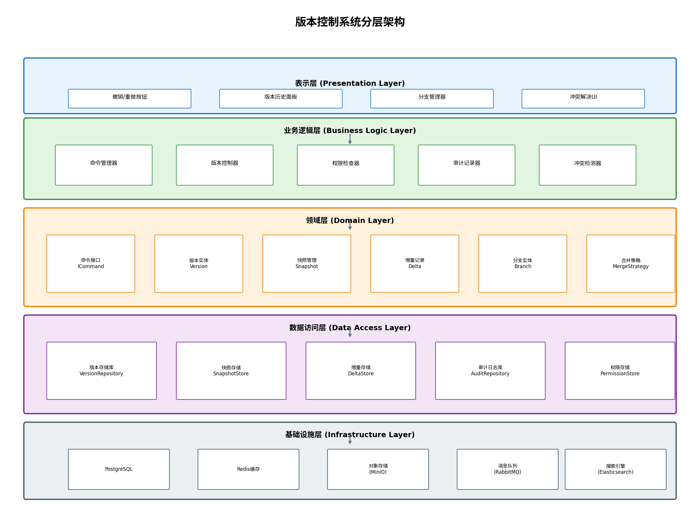
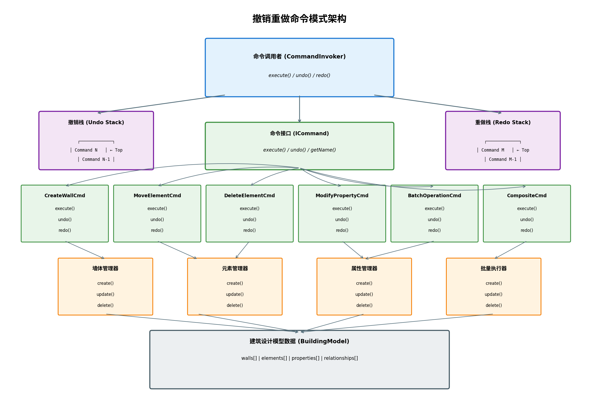
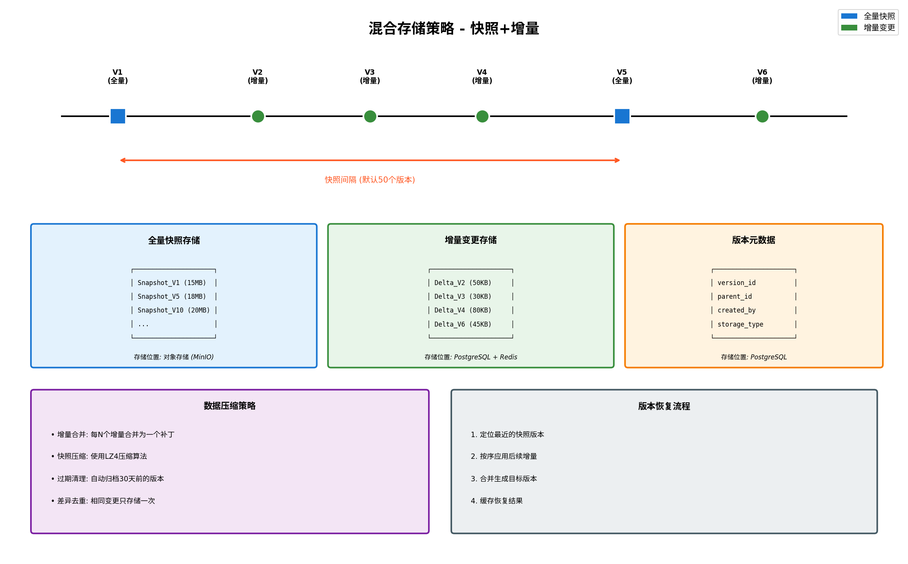
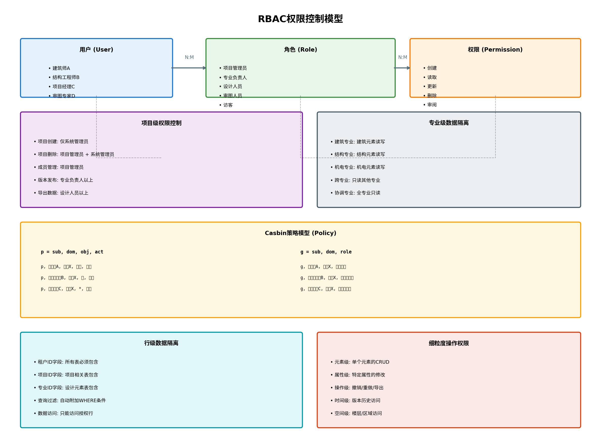
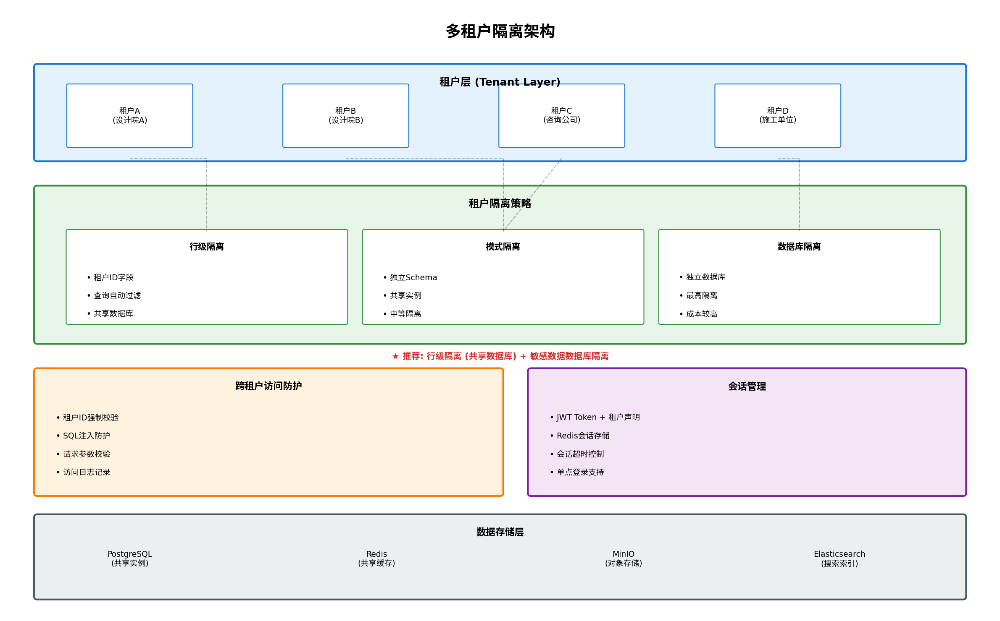
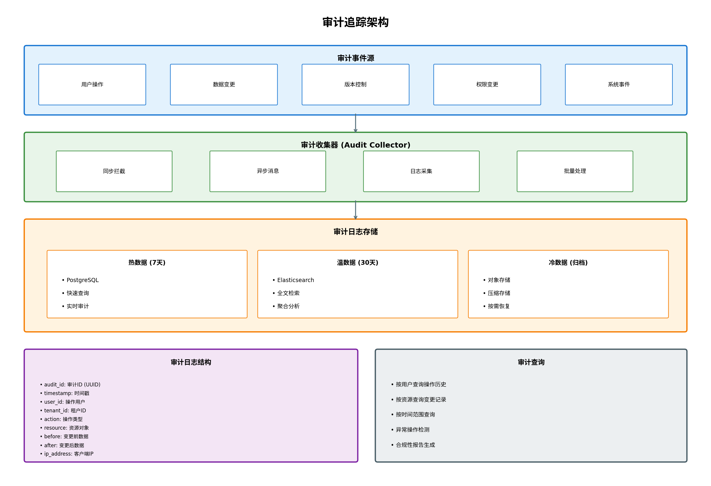
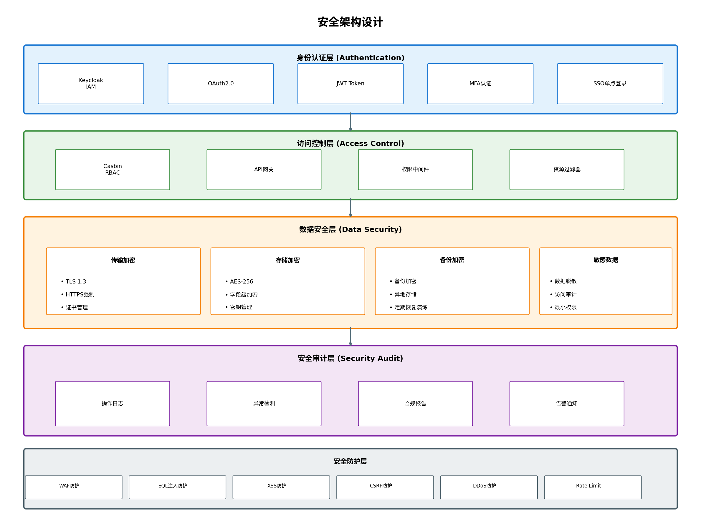

# 半自动化建筑设计平台 - 版本控制架构设计报告

## 概要设计阶段

---

## 目录

1. [版本控制架构总体设计](#1-版本控制架构总体设计)
2. [撤销重做架构设计](#2-撤销重做架构设计)
3. [历史版本管理设计](#3-历史版本管理设计)
4. [权限控制架构设计](#4-权限控制架构设计)
5. [账号隔离设计](#5-账号隔离设计)
6. [审计追踪设计](#6-审计追踪设计)
7. [安全架构设计](#7-安全架构设计)

---

## 1. 版本控制架构总体设计

### 1.1 版本控制系统分层架构



版本控制系统采用五层架构设计：

| 层级 | 组件 | 职责 |
|------|------|------|
| 表示层 | 撤销/重做按钮、版本历史面板、分支管理器、冲突解决UI | 用户交互界面 |
| 业务逻辑层 | 命令管理器、版本控制器、权限检查器、审计记录器、冲突检测器 | 核心业务逻辑 |
| 领域层 | 命令接口、版本实体、快照管理、增量记录、分支实体、合并策略 | 领域模型定义 |
| 数据访问层 | 版本存储库、快照存储、增量存储、审计日志库、权限存储 | 数据持久化 |
| 基础设施层 | PostgreSQL、Redis、MinIO、RabbitMQ、Elasticsearch | 底层存储和中间件 |

### 1.2 版本数据流设计

```
┌─────────────────────────────────────────────────────────────────┐
│                        版本数据流                                │
└─────────────────────────────────────────────────────────────────┘

用户操作 → 命令封装 → 权限校验 → 执行操作 → 记录日志 → 版本存储
              ↓           ↓           ↓           ↓           ↓
         创建命令    Casbin检查   修改模型    审计记录   快照/增量
              ↓           ↓           ↓           ↓           ↓
         压入栈中    行级过滤    生成增量    异步写入   元数据记录
```

### 1.3 版本状态管理

版本状态采用有限状态机管理：

```
                    ┌─────────────┐
                    │   INITIAL   │
                    └──────┬──────┘
                           │ 创建版本
                           ▼
                    ┌─────────────┐
              ┌────│   ACTIVE    │────┐
              │    └──────┬──────┘    │
              │           │           │
        发布版本          │          归档
              │           │           │
              ▼           ▼           ▼
        ┌─────────┐  ┌─────────┐  ┌─────────┐
        │RELEASED │  │MODIFIED │  │ARCHIVED │
        └────┬────┘  └────┬────┘  └────┬────┘
             │            │            │
             └────────────┴────────────┘
                          │
                          ▼
                   ┌─────────────┐
                   │  DELETED    │
                   └─────────────┘
```

### 1.4 版本存储策略

采用**混合存储策略**：全量快照 + 增量变更

| 存储类型 | 存储内容 | 存储位置 | 压缩方式 |
|----------|----------|----------|----------|
| 全量快照 | 完整模型数据 | MinIO对象存储 | LZ4压缩 |
| 增量变更 | 变更操作记录 | PostgreSQL + Redis | JSON压缩 |
| 版本元数据 | 版本信息、关系 | PostgreSQL | 无 |

**快照间隔策略**：
- 默认每50个版本创建一次全量快照
- 可配置快照间隔
- 手动触发快照创建

---

## 2. 撤销重做架构设计

### 2.1 命令模式架构



### 2.2 核心组件设计

#### 2.2.1 命令接口 (ICommand)

```typescript
interface ICommand {
    execute(): void;           // 执行命令
    undo(): void;              // 撤销命令
    redo(): void;              // 重做命令
    getName(): string;         // 获取命令名称
    getTimestamp(): Date;      // 获取执行时间
    getUserId(): string;       // 获取操作用户
}
```

#### 2.2.2 命令调用者 (CommandInvoker)

```typescript
class CommandInvoker {
    private undoStack: ICommand[] = [];  // 撤销栈
    private redoStack: ICommand[] = [];  // 重做栈
    private maxStackSize: number = 100;  // 最大栈深度
    
    execute(command: ICommand): void {
        command.execute();
        this.undoStack.push(command);
        this.redoStack = [];  // 清空重做栈
        this.trimStack();
    }
    
    undo(): void {
        if (this.undoStack.length > 0) {
            const command = this.undoStack.pop()!;
            command.undo();
            this.redoStack.push(command);
        }
    }
    
    redo(): void {
        if (this.redoStack.length > 0) {
            const command = this.redoStack.pop()!;
            command.redo();
            this.undoStack.push(command);
        }
    }
}
```

### 2.3 操作日志设计

操作日志结构：

```typescript
interface OperationLog {
    logId: string;              // 日志ID
    commandType: string;        // 命令类型
    commandName: string;        // 命令名称
    userId: string;             // 操作用户
    projectId: string;          // 项目ID
    timestamp: Date;            // 操作时间
    beforeState: any;           // 操作前状态
    afterState: any;            // 操作后状态
    metadata: {                 // 元数据
        elementId?: string;
        elementType?: string;
        propertyName?: string;
    };
}
```

### 2.4 撤销栈/重做栈管理

**栈管理策略**：

| 策略 | 说明 | 默认值 |
|------|------|--------|
| 最大栈深度 | 限制撤销历史数量 | 100条 |
| 栈压缩 | 合并连续相同类型操作 | 启用 |
| 持久化 | 会话间保持撤销历史 | 可选 |
| 分组撤销 | 批量操作作为整体 | 启用 |

**状态转换**：

```
初始状态: undoStack=[], redoStack=[]

执行命令A: undoStack=[A], redoStack=[]
执行命令B: undoStack=[A,B], redoStack=[]
撤销:      undoStack=[A], redoStack=[B]
撤销:      undoStack=[], redoStack=[B,A]
重做:      undoStack=[A], redoStack=[B]
执行命令C: undoStack=[A,C], redoStack=[]  (重做栈清空)
```

### 2.5 批量操作撤销

**CompositeCommand 组合命令模式**：

```typescript
class CompositeCommand implements ICommand {
    private commands: ICommand[] = [];
    
    add(command: ICommand): void {
        this.commands.push(command);
    }
    
    execute(): void {
        for (const cmd of this.commands) {
            cmd.execute();
        }
    }
    
    undo(): void {
        // 逆序撤销
        for (let i = this.commands.length - 1; i >= 0; i--) {
            this.commands[i].undo();
        }
    }
    
    redo(): void {
        for (const cmd of this.commands) {
            cmd.redo();
        }
    }
}
```

---

## 3. 历史版本管理设计

### 3.1 快照管理设计



**快照管理器**：

```typescript
class SnapshotManager {
    private snapshotInterval: number = 50;  // 快照间隔
    private snapshotCounter: number = 0;    // 版本计数器
    
    async createSnapshot(versionId: string, model: BuildingModel): Promise<void> {
        const snapshot: Snapshot = {
            versionId: versionId,
            data: await this.compress(model),
            createdAt: new Date(),
            size: this.calculateSize(model)
        };
        await this.snapshotStore.save(snapshot);
    }
    
    async shouldCreateSnapshot(): Promise<boolean> {
        this.snapshotCounter++;
        return this.snapshotCounter >= this.snapshotInterval;
    }
    
    async getNearestSnapshot(targetVersionId: string): Promise<Snapshot> {
        // 查找最近的全量快照
        return await this.snapshotStore.findNearest(targetVersionId);
    }
}
```

### 3.2 增量存储设计

**增量记录结构**：

```typescript
interface Delta {
    deltaId: string;
    versionId: string;
    parentVersionId: string;
    operation: OperationType;
    target: {
        elementId: string;
        elementType: string;
    };
    changes: {
        property: string;
        oldValue: any;
        newValue: any;
    }[];
    timestamp: Date;
}

type OperationType = 
    | 'CREATE' 
    | 'UPDATE' 
    | 'DELETE' 
    | 'MOVE' 
    | 'RESIZE' 
    | 'ROTATE';
```

### 3.3 版本对比设计

**版本对比器**：

```typescript
class VersionComparator {
    async compareVersions(
        versionA: string, 
        versionB: string
    ): Promise<VersionDiff> {
        const modelA = await this.versionManager.load(versionA);
        const modelB = await this.versionManager.load(versionB);
        
        return {
            added: this.findAddedElements(modelA, modelB),
            removed: this.findRemovedElements(modelA, modelB),
            modified: this.findModifiedElements(modelA, modelB),
            unchanged: this.findUnchangedElements(modelA, modelB)
        };
    }
    
    private findModifiedElements(a: BuildingModel, b: BuildingModel): ModifiedElement[] {
        // 对比元素属性变化
        const modified: ModifiedElement[] = [];
        for (const elemB of b.elements) {
            const elemA = a.findElement(elemB.id);
            if (elemA && !this.isEqual(elemA, elemB)) {
                modified.push({
                    elementId: elemB.id,
                    before: elemA,
                    after: elemB,
                    propertyChanges: this.compareProperties(elemA, elemB)
                });
            }
        }
        return modified;
    }
}
```

### 3.4 版本回滚设计

**版本回滚流程**：

```
1. 用户选择目标版本
        ↓
2. 定位最近快照
        ↓
3. 加载快照数据
        ↓
4. 按序应用增量
        ↓
5. 生成目标版本
        ↓
6. 创建回滚记录
        ↓
7. 更新当前版本指针
```

```typescript
class VersionRollback {
    async rollbackToVersion(targetVersionId: string): Promise<void> {
        // 1. 获取最近快照
        const snapshot = await this.snapshotManager
            .getNearestSnapshot(targetVersionId);
        
        // 2. 加载快照
        let model = await this.loadSnapshot(snapshot);
        
        // 3. 获取需要应用的增量
        const deltas = await this.deltaStore
            .getDeltasBetween(snapshot.versionId, targetVersionId);
        
        // 4. 按序应用增量
        for (const delta of deltas) {
            model = await this.applyDelta(model, delta);
        }
        
        // 5. 创建回滚记录
        await this.createRollbackRecord(targetVersionId);
        
        // 6. 更新当前版本
        await this.versionManager.setCurrentVersion(targetVersionId);
    }
}
```

---

## 4. 权限控制架构设计

### 4.1 RBAC模型设计



**RBAC核心模型**：

```
用户(User) ←──N:M──→ 角色(Role) ←──N:M──→ 权限(Permission)
```

**角色定义**：

| 角色 | 职责 | 权限范围 |
|------|------|----------|
| 系统管理员 | 系统管理 | 全部权限 |
| 项目管理员 | 项目管理 | 项目级管理 |
| 专业负责人 | 专业管理 | 专业内全部 |
| 设计人员 | 设计工作 | 创建/修改 |
| 审图人员 | 审图工作 | 只读+批注 |
| 访客 | 查看 | 只读 |

### 4.2 项目级权限设计

**Casbin策略模型**：

```
[request_definition]
r = sub, dom, obj, act

[policy_definition]
p = sub, dom, obj, act

[role_definition]
g = _, _, _
g2 = _, _

[policy_effect]
e = some(where (p.eft == allow))

[matchers]
m = g(r.sub, p.sub, r.dom) && r.dom == p.dom && r.obj == p.obj && r.act == p.act
```

**策略示例**：

```csv
# 策略规则
p, designer_role, project_x, wall, create
p, designer_role, project_x, wall, update
p, designer_role, project_x, wall, read
p, pm_role, project_x, *, manage
p, reviewer_role, project_x, *, read

# 角色分配
g, user_a, project_x, designer_role
g, user_b, project_x, pm_role
g, user_c, project_x, reviewer_role
```

### 4.3 专业级数据隔离设计

**专业隔离策略**：

```typescript
interface DisciplineIsolation {
    // 专业定义
    disciplines: {
        ARCHITECTURE: '建筑',
        STRUCTURE: '结构',
        MEP: '机电',
        COORDINATION: '协调'
    };
    
    // 权限矩阵
    permissionMatrix: {
        [discipline: string]: {
            own: Permission[];      // 本专业权限
            others: Permission[];   // 其他专业权限
        }
    };
}

// 专业权限矩阵
const disciplinePermissions = {
    ARCHITECTURE: {
        own: ['CREATE', 'READ', 'UPDATE', 'DELETE'],
        others: ['READ']  // 只能读取其他专业
    },
    COORDINATION: {
        own: ['READ'],    // 协调专业只有读取权限
        others: ['READ']
    }
};
```

### 4.4 细粒度操作权限设计

**权限粒度层级**：

| 粒度级别 | 控制对象 | 实现方式 |
|----------|----------|----------|
| 项目级 | 整个项目 | Casbin策略 |
| 专业级 | 专业数据 | 行级过滤 |
| 元素级 | 单个元素 | 资源过滤器 |
| 属性级 | 元素属性 | 字段级权限 |
| 操作级 | 具体操作 | 方法级注解 |

---

## 5. 账号隔离设计

### 5.1 多租户架构设计



### 5.2 租户隔离策略

| 隔离级别 | 实现方式 | 隔离强度 | 成本 |
|----------|----------|----------|------|
| 行级隔离 | 租户ID字段 | 中 | 低 |
| 模式隔离 | 独立Schema | 高 | 中 |
| 数据库隔离 | 独立数据库 | 最高 | 高 |

**推荐方案**：行级隔离 + 敏感数据数据库隔离

### 5.3 行级隔离实现

```typescript
// 实体基类
abstract class TenantEntity {
    tenantId: string;  // 租户ID字段
    
    @BeforeInsert()
    @BeforeUpdate()
    validateTenant(): void {
        const currentTenant = TenantContext.getCurrentTenant();
        if (this.tenantId !== currentTenant) {
            throw new CrossTenantAccessException();
        }
    }
}

// 查询拦截器
class TenantQueryInterceptor {
    intercept(query: SelectQueryBuilder<any>): void {
        const tenantId = TenantContext.getCurrentTenant();
        query.andWhere(`${query.alias}.tenantId = :tenantId`, { tenantId });
    }
}
```

### 5.4 跨租户访问防护

**防护措施**：

1. **租户ID强制校验**
   - 所有数据操作必须携带租户ID
   - 服务端强制校验租户ID

2. **SQL注入防护**
   - 使用参数化查询
   - 租户ID作为绑定参数

3. **请求参数校验**
   - 校验请求中的租户ID
   - 与Token中的租户ID比对

4. **访问日志记录**
   - 记录所有跨租户访问尝试
   - 异常访问触发告警

### 5.5 会话管理设计

**JWT Token结构**：

```json
{
    "sub": "user_id",
    "tenant_id": "tenant_001",
    "roles": ["designer", "reviewer"],
    "projects": ["proj_001", "proj_002"],
    "iat": 1234567890,
    "exp": 1234571490
}
```

**会话管理器**：

```typescript
class SessionManager {
    async createSession(user: User): Promise<Session> {
        const token = jwt.sign({
            sub: user.id,
            tenant_id: user.tenantId,
            roles: user.roles,
            projects: user.projects
        }, JWT_SECRET, { expiresIn: '8h' });
        
        // 存储到Redis
        await this.redis.setex(
            `session:${user.id}`,
            8 * 3600,
            JSON.stringify({ token, user })
        );
        
        return { token, expiresAt: Date.now() + 8 * 3600 * 1000 };
    }
    
    async validateSession(token: string): Promise<SessionInfo> {
        const decoded = jwt.verify(token, JWT_SECRET);
        const session = await this.redis.get(`session:${decoded.sub}`);
        
        if (!session) {
            throw new SessionExpiredException();
        }
        
        // 设置当前租户上下文
        TenantContext.setCurrentTenant(decoded.tenant_id);
        
        return JSON.parse(session);
    }
}
```

---

## 6. 审计追踪设计

### 6.1 审计日志架构



### 6.2 审计事件源

| 事件类型 | 事件示例 | 收集方式 |
|----------|----------|----------|
| 用户操作 | 登录、登出、修改密码 | 同步拦截 |
| 数据变更 | 创建墙体、修改属性 | 异步消息 |
| 版本控制 | 提交版本、回滚版本 | 异步消息 |
| 权限变更 | 角色分配、权限修改 | 同步拦截 |
| 系统事件 | 备份完成、导出完成 | 日志采集 |

### 6.3 操作追踪设计

**审计日志结构**：

```typescript
interface AuditLog {
    // 基础信息
    auditId: string;        // 审计ID (UUID)
    timestamp: Date;        // 时间戳
    
    // 用户信息
    userId: string;         // 操作用户
    userName: string;       // 用户名称
    tenantId: string;       // 租户ID
    
    // 操作信息
    action: ActionType;     // 操作类型
    resource: string;       // 资源对象
    resourceId: string;     // 资源ID
    
    // 变更数据
    before: any;            // 变更前数据
    after: any;             // 变更后数据
    
    // 上下文信息
    ipAddress: string;      // 客户端IP
    userAgent: string;      // 用户代理
    sessionId: string;      // 会话ID
    projectId: string;      // 项目ID
    
    // 结果
    success: boolean;       // 是否成功
    errorMessage?: string;  // 错误信息
}

type ActionType = 
    | 'CREATE' | 'READ' | 'UPDATE' | 'DELETE'
    | 'LOGIN' | 'LOGOUT' | 'EXPORT' | 'IMPORT'
    | 'COMMIT' | 'ROLLBACK' | 'MERGE' | 'BRANCH';
```

### 6.4 变更追踪设计

**变更追踪实现**：

```typescript
@Injectable()
class ChangeTracker {
    @Around('@annotation(Auditable)')
    async trackChange(joinPoint: JoinPoint): Promise<any> {
        const before = await this.captureState(joinPoint);
        
        try {
            const result = await joinPoint.proceed();
            const after = await this.captureState(joinPoint);
            
            await this.auditService.record({
                action: this.getActionType(joinPoint),
                before: before,
                after: after,
                success: true
            });
            
            return result;
        } catch (error) {
            await this.auditService.record({
                action: this.getActionType(joinPoint),
                before: before,
                success: false,
                errorMessage: error.message
            });
            throw error;
        }
    }
}
```

### 6.5 审计查询设计

**审计查询服务**：

```typescript
class AuditQueryService {
    // 按用户查询
    async findByUser(
        userId: string, 
        options: QueryOptions
    ): Promise<AuditLog[]> {
        return this.auditRepository.find({
            where: { userId },
            order: { timestamp: 'DESC' },
            skip: options.offset,
            take: options.limit
        });
    }
    
    // 按资源查询
    async findByResource(
        resourceType: string,
        resourceId: string
    ): Promise<AuditLog[]> {
        return this.auditRepository.find({
            where: { resource: resourceType, resourceId },
            order: { timestamp: 'DESC' }
        });
    }
    
    // 按时间范围查询
    async findByTimeRange(
        startTime: Date,
        endTime: Date,
        filters: AuditFilters
    ): Promise<AuditLog[]> {
        const query = this.auditRepository.createQueryBuilder('audit')
            .where('audit.timestamp BETWEEN :start AND :end', { 
                start: startTime, 
                end: endTime 
            });
        
        if (filters.userId) {
            query.andWhere('audit.userId = :userId', { userId: filters.userId });
        }
        
        if (filters.action) {
            query.andWhere('audit.action = :action', { action: filters.action });
        }
        
        return query.orderBy('audit.timestamp', 'DESC').getMany();
    }
    
    // 异常检测
    async detectAnomalies(timeWindow: number): Promise<Anomaly[]> {
        const anomalies: Anomaly[] = [];
        
        // 检测频繁失败
        const frequentFailures = await this.detectFrequentFailures(timeWindow);
        anomalies.push(...frequentFailures);
        
        // 检测异常时间访问
        const unusualTimeAccess = await this.detectUnusualTimeAccess(timeWindow);
        anomalies.push(...unusualTimeAccess);
        
        // 检测跨租户访问
        const crossTenantAccess = await this.detectCrossTenantAccess(timeWindow);
        anomalies.push(...crossTenantAccess);
        
        return anomalies;
    }
}
```

### 6.6 数据分层存储

| 数据类型 | 存储时长 | 存储介质 | 用途 |
|----------|----------|----------|------|
| 热数据 | 7天 | PostgreSQL | 实时审计查询 |
| 温数据 | 30天 | Elasticsearch | 全文检索、聚合分析 |
| 冷数据 | 永久 | MinIO | 归档、合规 |

---

## 7. 安全架构设计

### 7.1 身份认证设计



**认证流程**：

```
用户登录 → Keycloak认证 → OAuth2授权 → JWT签发 → 会话建立
    ↓
MFA验证(可选) → 权限加载 → 租户上下文设置
```

**Keycloak集成**：

```typescript
class KeycloakAuthProvider {
    private keycloak: Keycloak;
    
    async authenticate(credentials: Credentials): Promise<AuthResult> {
        // 1. 验证用户名密码
        const tokenResponse = await this.keycloak.grantManager
            .obtainDirectly(credentials.username, credentials.password);
        
        // 2. 获取用户信息
        const userInfo = await this.keycloak.grantManager
            .userInfo(tokenResponse.access_token);
        
        // 3. 获取用户角色
        const roles = await this.getUserRoles(userInfo.sub);
        
        // 4. 生成应用Token
        const appToken = this.generateAppToken({
            userId: userInfo.sub,
            tenantId: userInfo.tenant_id,
            roles: roles
        });
        
        return { token: appToken, user: userInfo };
    }
}
```

### 7.2 访问控制设计

**多层访问控制**：

| 层级 | 控制点 | 实现 |
|------|--------|------|
| 网关层 | API访问 | API Gateway + JWT验证 |
| 应用层 | 方法调用 | Casbin + 注解 |
| 数据层 | 数据访问 | 行级过滤 + 字段级权限 |

**Casbin中间件**：

```typescript
@Injectable()
class CasbinAuthMiddleware implements NestMiddleware {
    constructor(private enforcer: Enforcer) {}
    
    async use(req: Request, res: Response, next: NextFunction) {
        const user = req.user;
        const tenantId = user.tenantId;
        const resource = req.params.resource;
        const action = req.method;
        
        const allowed = await this.enforcer.enforce(
            user.id, tenantId, resource, action
        );
        
        if (!allowed) {
            throw new ForbiddenException('Access denied');
        }
        
        next();
    }
}
```

### 7.3 数据加密设计

**加密策略**：

| 数据类型 | 加密方式 | 密钥管理 |
|----------|----------|----------|
| 传输数据 | TLS 1.3 | 证书管理 |
| 存储数据 | AES-256 | 密钥管理服务 |
| 敏感字段 | 字段级加密 | 独立密钥 |
| 备份数据 | AES-256 + 压缩 | 备份密钥 |

**字段级加密示例**：

```typescript
@Entity()
class Project {
    @PrimaryKey()
    id: string;
    
    @Column()
    name: string;
    
    @Column()
    @Encrypted()  // 敏感字段加密
    clientContact: string;
    
    @Column()
    @Encrypted()
    budget: number;
}

// 加密装饰器
function Encrypted() {
    return function(target: any, propertyKey: string) {
        // 注册加密字段
        EncryptedFieldsRegistry.register(target.constructor, propertyKey);
    };
}
```

### 7.4 安全审计设计

**安全审计内容**：

| 审计类型 | 审计内容 | 告警条件 |
|----------|----------|----------|
| 登录审计 | 登录时间、IP、结果 | 连续失败3次 |
| 操作审计 | 敏感操作记录 | 越权操作 |
| 数据审计 | 数据访问记录 | 批量导出 |
| 系统审计 | 配置变更记录 | 异常配置 |

**异常检测规则**：

```typescript
const securityRules = {
    // 暴力破解检测
    bruteForce: {
        condition: 'login_failures > 3 in 5 minutes',
        action: 'lock_account_15min'
    },
    
    // 异常时间访问
    unusualTime: {
        condition: 'access_time NOT IN business_hours',
        action: 'require_mfa'
    },
    
    // 跨租户访问
    crossTenant: {
        condition: 'tenant_id != user_tenant_id',
        action: 'block_and_alert'
    },
    
    // 批量导出
    bulkExport: {
        condition: 'export_count > 100 in 1 hour',
        action: 'require_approval'
    }
};
```

---

## 附录

### A. 技术栈清单

| 组件 | 技术选型 | 版本 |
|------|----------|------|
| 撤销重做 | 命令模式 + 操作日志 | - |
| 版本存储 | 混合存储（快照+增量） | - |
| 权限管理 | Casbin + 行级隔离 | v2.x |
| 身份认证 | Keycloak + OAuth2.0 + JWT | v20+ |
| 数据库 | PostgreSQL | v14+ |
| 缓存 | Redis | v7+ |
| 对象存储 | MinIO | latest |
| 消息队列 | RabbitMQ | v3.11+ |
| 搜索引擎 | Elasticsearch | v8+ |

### B. 接口清单

| 接口 | 路径 | 方法 | 权限 |
|------|------|------|------|
| 撤销 | /api/v1/undo | POST | design |
| 重做 | /api/v1/redo | POST | design |
| 创建版本 | /api/v1/versions | POST | design |
| 获取版本 | /api/v1/versions/{id} | GET | read |
| 版本回滚 | /api/v1/versions/{id}/rollback | POST | manage |
| 版本对比 | /api/v1/versions/compare | POST | read |
| 查询审计 | /api/v1/audit/logs | GET | audit |

---

**文档版本**: v1.0  
**编写日期**: 2024年  
**编写人**: 版本控制系统专家
